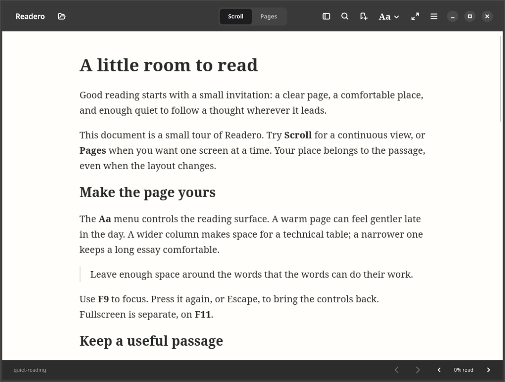

# Readero

A quiet native reader for Ubuntu, built around comfortable reading and keeping your place. Open a local PDF, DRM-free reflowable EPUB, or Markdown document; choose **Scroll** or **Pages**; return to the passage later.

Readero 0.1.1 is a working personal preview. The implementation has undergone native integration and visual checks. The complete release qualification and everyday reading sessions in the [MVP PRD](docs/MVP_PRD.md) are still separate gates; see the [implementation and QA record](docs/IMPLEMENTATION.md).

## Try it on this machine

The optimized executable is `target/release/readero`. From the project directory:

```sh
./target/release/readero examples/quiet-reading.md
```

After packaging, `dist/readero_0.1.1_amd64.deb` provides the desktop launcher and Open With integration:

```sh
sudo apt install ./dist/readero_0.1.1_amd64.deb
```

The package targets **Ubuntu 26.04 amd64 with Papers 50.2**. It is not a portable binary for arbitrary Linux releases. Installation is optional; the executable uses this machine's existing runtime libraries directly.



## Reading

- Open through the file picker, drag-and-drop, a file argument, or Open With.
- Return through Continue/recent documents, with per-document position and appearance.
- Use contents, whole-document search, bookmarks, and Back/Forward for intentional jumps.
- Adjust reflowable text, width, line spacing, and light/warm/dark reading palettes. PDFs retain their original page colors and offer zoom, fit, and rotation.
- Focus (`F9`) hides reading controls; fullscreen (`F11`) is independent. Escape brings controls back.
- Inspect an EPUB/Markdown illustration by clicking it or focusing it and pressing Enter. Escape closes the image first and returns focus. Code and tables have keyboard scrolling when oversized.

Useful shortcuts: `Ctrl+O` Open, `Ctrl+F` Search, `Ctrl+G` / `Ctrl+Shift+G` next/previous result, `Ctrl+D` Bookmark, `Ctrl+L` PDF page, `Alt+Left/Right` Back/Forward, `F8` sidebar. The menu includes a shortcut reference.

Progress and bookmarks live in `$XDG_DATA_HOME/readero/reading.sqlite3` (normally `~/.local/share/readero/reading.sqlite3`). `READERO_DATA_DIR` selects an alternate directory for testing. Close the app before backing up the database. Original documents are never edited or imported into a managed library. Remove from recents preserves bookmarks. Locate reconnects a moved file.

Notes, highlights, OCR, cloud sync, DRM, fixed-layout EPUB guarantees, PDF forms, and source editing are outside this preview. Markdown supports CommonMark, tables, task lists, strikethrough, footnotes, and heading fragments; raw HTML is displayed as text. Automatic remote content and publication scripts are disabled. Markdown sidecar resources stay within the source directory tree.

## Build

Rust 1.98 and the following Ubuntu development packages are needed:

```sh
sudo apt install build-essential pkg-config libgtk-4-dev libadwaita-1-dev \
  libwebkitgtk-6.0-dev libpapers-dev libsqlite3-dev
cargo build --locked --release
./scripts/package-deb
```

For the current workspace, development packages were checksum-verified and extracted under `/tmp`; no system packages were installed. Reproduce that optional setup with:

```sh
python3 scripts/prepare-local-build.py
./scripts/cargo-local build --locked --release
```

`cargo-local` is a machine-specific convenience wrapper for that temporary prefix. Ordinary installations should use Cargo directly. The native runtime remains the Ubuntu-provided one.

## Check the implementation

```sh
cargo fmt --package readero --check
cargo test --locked
cargo clippy --no-deps --all-targets --features smoke --locked -- -D warnings
```

Use `scripts/cargo-local` in place of `cargo` with the temporary development prefix. `--no-deps` keeps strict linting focused on authored code; vendored upstream bindings remain unchanged.

The opt-in `smoke` feature drives the **real native application** and captures local screenshots and assertions. It is excluded from the ordinary executable. Python Cairo, Xvfb, and `dbus-run-session` are required for the isolated display route:

```sh
python3 tests/fixtures/generate.py
cargo build --locked --release --features smoke
python3 scripts/native-smoke.py --file examples/quiet-reading.md \
  --output /tmp/readero-check-md
python3 scripts/native-smoke.py --file /tmp/readero-build/fixtures/reading.epub \
  --output /tmp/readero-check-epub --stress
cargo build --locked --release  # restore an ordinary build before packaging
```

The smoke checks include exact bookmark recovery after edits, delayed images, width changes, overlapping chapter loads and jumps, keyboard affordances, and PDF restoration at every rotation in both reading modes. Add `--edit` to exercise source watching, atomic replacement, related-file heading links, and Back/Forward using a temporary Markdown copy. Keep the smoke executable separate if running other Cargo builds concurrently; those builds can replace it with an ordinary executable.

For the protected-PDF flow, install the test-only Python `pypdf` dependency, then run `python3 tests/fixtures/protect.py /tmp/readero-build/fixtures/reading.pdf /tmp/readero-build/fixtures/protected.pdf` and pass `--protected-fixture` with that file.

Use a fresh output directory for each run. Evidence contains reading locators, passages, and screenshots: keep personal-document runs outside the repository. `checks.json` contains only safe boolean outcomes. `--wayland` exercises the current desktop; the default uses Xvfb/software rendering. These flows establish behavior, not PRD startup/frame-time percentiles.

Separate native probes use the optimized application without the smoke driver's fixed navigation waits:

```sh
python3 scripts/native-qualify.py --binary /path/to/smoke-enabled-readero \
  --file examples/quiet-reading.md --output /tmp/readero-restart --mode restart
python3 scripts/native-qualify.py --binary /path/to/smoke-enabled-readero \
  --file examples/quiet-reading.md --output /tmp/readero-timing --mode timing
xvfb-run -a dbus-run-session -- python3 scripts/accessibility-smoke.py \
  --binary /path/to/readero --output /tmp/readero-accessibility
```

`restart` checks forced termination, an interrupted SQLite writer, and closing during a layout change, all against isolated state. `timing` collects 10 launches and 30 reopens on the current Wayland desktop; `idle` measures the actual app process tree after 40 turns and 20 mode changes. These are diagnostic observations, not a claim that the full PRD performance protocol has passed. The accessibility script inspects native controls, headings, and text through AT-SPI; it does not run an Orca usability session. Python GI/AT-SPI bindings are required for that check.

## Code and decisions

Rust/GTK4/libadwaita own the shell; Papers owns PDF rendering; WebKitGTK with pinned foliate-js handles EPUB and rendered Markdown. A dedicated worker owns SQLite. Document identity and versioned locators are independent of the presentation mode, leaving a path to linked notes later.

- [Finalized MVP PRD](docs/MVP_PRD.md)
- [Stack decisions and sources](docs/STACK_DECISIONS.md)
- [Implementation and QA](docs/IMPLEMENTATION.md)
- [Original component research](docs/research/VALIDATION.md)
- [Upstream provenance and licenses](vendor/README.md)

This is a personal project. Upstream source and license notices are preserved in `vendor/` and `assets/foliate/`.
