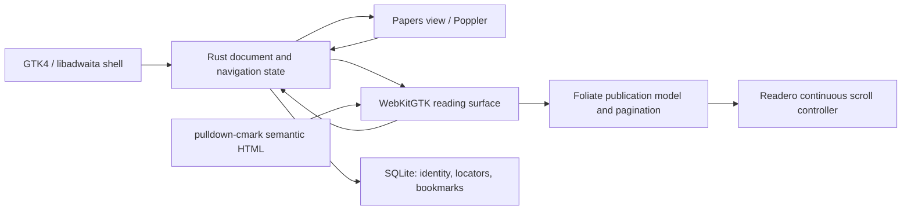

# Readero: stack decisions

Decision date: 4 September 2026. Target: the owner's Ubuntu 26.04.1 machine.

This is the implementation baseline for a personal reader. It is supported by primary-source research, source inspection, local document profiling, native component probes, and a Rust dependency-resolution check. It does not claim that an application has been built or that its performance targets have already been met. The [validation record](research/VALIDATION.md) distinguishes those levels of evidence.

## Recommendation

Build a Rust application with GTK4 and libadwaita. Embed the Papers view/document libraries for PDFs. Use WebKitGTK 6.0 with a pinned foliate-js snapshot for EPUB parsing, publication resources, pagination, and EPUB passage references. Own a bounded continuous-scrolling controller over that same publication model. Convert Markdown to semantic HTML with pulldown-cmark and present it through the reflowable reading surface. Store document identity, reading state, preferences, and bookmarks in SQLite through rusqlite.

Use native Ubuntu libraries and produce an Ubuntu 26.04 `.deb` for the first installable release. Keep the application local and usable offline. Future notebooks and annotations build on the document identity and locator model, without requiring their UI in the MVP.

The largest deliberate engineering commitment is continuous EPUB scrolling. It is a first-class implementation milestone, not a feature assumed to exist in foliate-js.

## What the actual machine and documents changed

The machine runs Ubuntu 26.04.1, x86-64, Wayland, with an Intel Core Ultra 7 255U and approximately 30.4 GiB of usable RAM. Installed libraries include GTK 4.22.4, libadwaita 1.9.1, WebKitGTK 2.52.6, Papers 50.2, and Poppler 26.01.0. These are observed versions, not minimum requirements for every future installation. See [environment evidence](research/evidence/environment.json).

The authorized Downloads directory contained 19 EPUBs and 14 PDFs, with no Markdown samples. All 19 EPUBs declared EPUB 3.0 and reflowable layout; no encryption metadata or script elements were found in that structural scan. This is not a general safety audit of those publications. The largest EPUB was 20,882,699 bytes; the largest XHTML resource was 271,690 bytes. Code, tables, images, and some MathML occur in the corpus. The PDFs are only one to six pages; one requires a password, and the largest is an image scan. See [corpus evidence](research/evidence/corpus-profile.json).

Consequences: prioritize technical EPUB fidelity, image inspection, code/table overflow, password prompts, and honest handling of scans. Add synthetic or freely redistributable long PDFs, EPUB 2 files, malformed files, and Markdown fixtures before release. The present sample cannot validate those cases.

## D01: Ubuntu 26.04 first, native GTK4/libadwaita

**Selected.** Use ordinary GTK widgets for the shell, preferences, navigation, and future notebook. Use libadwaita conventions, accessible labels, focus handling, and restrained styling. Keep publication typography independently configurable.

Why: this is a personal Ubuntu application, and the required native runtimes are already installed. GTK has a Wayland backend, and WebKitGTK has a GTK4 API. There is no current requirement for a shared Windows/macOS/mobile UI. Native controls reduce the amount of desktop interaction code we must own. They do not guarantee sharp content or fast rendering by themselves. [GTK Wayland documentation](https://docs.gtk.org/gtk4/wayland), [WebKitGTK GTK4 migration](https://webkitgtk.org/2024/03/27/webkigit-2.44.html).

Use GtkBuilder XML/CompositeTemplate plus small Rust controllers initially. An additional application framework such as Relm4 is unnecessary for the present number of screens. Blueprint can be introduced if maintaining the UI definitions becomes cumbersome; it is not a runtime requirement.

Other shell options were considered explicitly:

- **Tauri + web UI:** attractive for a Rust/web team and later cross-platform distribution. On Linux it uses the system WebKit through WebKitGTK; it does not eliminate browser-engine compatibility work. A predominantly web UI also makes embedding the chosen native Papers widget less direct. Those tradeoffs do not offer enough benefit for this Ubuntu-only scope. [Tauri webview model](https://v2.tauri.app/reference/webview-versions/), [Linux prerequisites](https://v2.tauri.app/start/prerequisites/).
- **Electron + web UI:** packages Chromium and Node, offering a consistent browser/runtime and convenient web tooling. It would be reasonable if that consistency or web development speed dominated. Here, reusing native GTK/Papers and installed Ubuntu engines is the better fit. No local Electron RAM/startup comparison was performed. [Electron architecture introduction](https://www.electronjs.org/docs/latest/).
- **Qt Quick:** a credible native alternative, especially with Qt PDF. The chosen GTK route has direct compatibility evidence on this machine; a switch to Qt would need its own EPUB/WebEngine and interaction qualification. This is not a universal toolkit ranking.

Validation: the installed Gtk, Adw, WebKit, PapersDocument, and PapersView libraries loaded through introspection; isolated GTK/Papers/WebKit objects were constructed. Native Wayland scaling, touchpad behavior, and Orca still need application-level verification.

## D02: Rust for the shell and state; JavaScript for publication layout

**Selected.** Rust owns file access, identity, SQLite, task cancellation, and application state. Small JavaScript modules own the DOM-facing reflow renderer. Communicate through typed, versioned messages.

Why: Rust gives useful type checking for durable state and asynchronous operations. Reusing browser layout avoids writing an HTML/CSS/MathML layout engine. GJS and Python could also build a responsive reader because the rendering is native; the decision is about maintainability and state modeling, not a proven language-speed advantage. Rust does not make the native C libraries memory safe.

Start with GLib's event loop and a small number of background workers. Do not add a second general-purpose async runtime until a concrete dependency needs it. Keep GTK and WebKit objects on their owning thread. Use Papers' own job infrastructure for its document work.

### Verified binding family

The following graph resolved successfully with Rust 1.98.0 and one GLib binding family:

- `gtk4` 0.10.3, `gdk4` 0.10.3.
- `glib`, `gio`, `cairo-rs` 0.21.5.
- `libadwaita` 0.8.1.
- `webkit6` 0.5.0.
- Papers Rust bindings from the Papers 50.2 source snapshot, commit `785ca168a98945f59d62308d664888c503ecf8ac`.
- `pulldown-cmark` 0.13.4 and `rusqlite` 0.40.2.

The older GTK-related crate family is intentional: the chosen Papers bindings depend on GTK 0.10 / GLib 0.21. The installed native WebKit stays at the Ubuntu-supported version; an older Rust binding is not an instruction to downgrade the engine. Future binding-family upgrades should be coordinated. [Papers pinned Cargo manifest](https://github.com/GNOME/papers/blob/785ca168a98945f59d62308d664888c503ecf8ac/Cargo.toml), [gtk-rs compatibility guidance](https://github.com/gtk-rs/gtk4-rs), [resolved evidence](research/evidence/rust-compatibility.json).

Pin the application lockfile and vendor the small Papers binding crates from that snapshot, retaining their notices. Their `0.1.0` package names alone do not identify the native library version. First implementation must compile/link this graph: the research environment lacks native development headers and `pkg-config`, so resolution is not a completed Rust GUI build.

## D03: Papers view/document libraries over Poppler

**Selected.** Embed `libppsview` and `libppsdocument`; use the Ubuntu Poppler backend through Papers.

Why: the product needs selection, links, search integration, continuous/paged layouts, zoom, document coordinates, caching, and keyboard behavior. A rendering engine alone leaves much of this work to the application. Papers exposes reusable viewer APIs for these needs. [Papers viewer API](https://gnome.pages.gitlab.gnome.org/papers/view/class.View.html), [pinned view header](https://github.com/GNOME/papers/blob/785ca168a98945f59d62308d664888c503ecf8ac/libview/pps-view.h).

Local result: three PDFs opened in the embedded component. Both mode switches retained the current page. Document points could be obtained and used to navigate back to a page. Selection/search succeeded on the text PDFs; the image-only PDF correctly had no selectable text. This does not yet establish pixel-exact restoration, manual selection quality in complex columns, or large-file performance. [Probe results](research/evidence/native-pdf-probe.json).

Embedding detail found by execution: Papers 50.2 needs the annotation model and annotation/search contexts wired before displaying the view. Simplified convenience-constructor probes produced null-object warnings/crashes. Matching the application's source wiring resolved them. Those internal objects are needed even while the MVP exposes no annotation editing UI. Keep this setup in one tested adapter. [Papers model/context wiring](https://github.com/GNOME/papers/blob/785ca168a98945f59d62308d664888c503ecf8ac/shell/resources/pps-document-view.blp).

Alternatives considered:

- **Raw Poppler:** a viable engine, but adds custom view/selection/cache/accessibility work. The Rust document wrapper is also `!Send` and `!Sync`; simply sending it to arbitrary worker threads is invalid. [poppler-rs Document](https://docs.rs/poppler-rs/latest/poppler/struct.Document.html).
- **MuPDF:** worth reconsidering if profiling finds an engine bottleneck. It supports both PDF and EPUB, but one engine does not establish equivalent browser-based EPUB layout or eliminate viewer work. No head-to-head rendering benchmark was performed. [MuPDF formats](https://mupdf.com/).
- **PDF.js:** a credible fallback with a reusable viewer layer. It would share WebKit with EPUB but would put PDF rendering in the browser pipeline and require separate WebKit qualification. It is not rejected as inherently slow. [PDF.js layers](https://mozilla.github.io/pdf.js/getting_started/).
- **Qt Quick + Qt PDF:** the strongest alternative native stack; its multipage component supplies selection, links, search, and navigation. It would change the shell ecosystem and still require an EPUB strategy. No measured performance disadvantage is claimed. [Qt PdfMultiPageView](https://doc.qt.io/qt-6/qml-qtquick-pdf-pdfmultipageview.html).

The Papers library's API version string `4.0` is not enough to manage all release changes. Track the installed package/ABI and test native updates. Use stable release sources, not the online documentation's development version, as the integration baseline.

## D04: WebKitGTK + pinned foliate-js, with an owned scroll controller

**Selected.** Pin foliate-js commit `78914aef4466eb960965702401634c2cb348e9b1`. Reuse its EPUB resource handling, CSS rewriting, table of contents, CFI passage references, and paginated renderer. Wrap it behind a Readero interface; do not spread library-specific objects through the application.

The library is modular but explicitly does not promise API stability. Its README distinguishes scrolled sections from true continuous scrolling; source inspection confirms it replaces the active section. Neither a feature-list checkbox nor section scrolling satisfies the agreed cross-chapter flow. [Pinned README](https://github.com/johnfactotum/foliate-js/blob/78914aef4466eb960965702401634c2cb348e9b1/README.md), [pinned paginator](https://github.com/johnfactotum/foliate-js/blob/78914aef4466eb960965702401634c2cb348e9b1/paginator.js).

Implement a continuous controller using the same `book.sections`, resource URLs, and CFI conversion. Keep a bounded set of neighboring section frames mounted; compensate the scroll position when inserting/removing content above the viewport; maintain locators across font/image loads and width changes. At narrow widths, an oversized table or code block must remain reachable. Do not flatten all chapters into one DOM, which would mix publisher styles and make memory grow with the whole book.

Feasibility evidence: a deliberately small three-section controller rendered a chapter boundary, inserted the previous section with zero measured viewport drift, resolved the same paragraph through CFI, and returned it to the paginated viewport in two sampled EPUBs. The probe does not implement full virtualization, resize recovery, selection across frames, error recovery, or arbitrary-book support. Those are a mandatory early milestone. [First proof](research/evidence/webkit-continuous-epub-02.json), [second proof](research/evidence/webkit-continuous-epub-14.json).

Alternatives considered:

- **EPUB.js 0.3.93:** its continuous manager displayed adjacent chapter frames in the installed WebKit, and a locator survived the mode transition. Its latest published package is from February 2022. Adopting it means accepting an older dependency/build ecosystem or maintaining a fork. Keep it as the fallback experiment if the bounded Foliate controller grows disproportionately complex, not as a second shipping EPUB engine. [Official project](https://github.com/futurepress/epub.js), [registry metadata](https://registry.npmjs.org/epubjs), [local test](research/evidence/webkit-epubjs-epub-02.json).
- **Readium TS Toolkit 2.8.2:** actively developed, with locators, reader preferences, and annotation foundations. It also requires a publication manifest/positions integration. Source inspection of its EPUB frame pool shows one active section with neighboring sections hidden, so it does not automatically remove the continuous-flow work. It was source-reviewed, not executed locally. [Pinned frame pool](https://github.com/readium/ts-toolkit/blob/893a5cc362605ad19f1be1d905159c1b7282c68d/navigator/src/epub/frame/FramePoolManager.ts), [navigator documentation](https://github.com/readium/ts-toolkit/blob/893a5cc362605ad19f1be1d905159c1b7282c68d/navigator/docs/epub/EpubNavigator.md).

Decision rule: the controller must pass chapter-boundary, delayed-image, resize, backward-navigation, and memory-bound tests before completing the EPUB milestone. If it fails, revisit this decision explicitly. Do not silently change Scroll into chapter-by-chapter navigation.

## D05: Markdown to semantic HTML through pulldown-cmark

**Selected.** Support CommonMark plus an explicit set of extensions: tables, task lists, strikethrough, and footnotes. Use source ranges to attach stable block identifiers. Avoid claiming complete GitHub Markdown parity. [Parser documentation](https://docs.rs/pulldown-cmark/latest/pulldown_cmark/).

Represent Markdown as a synthetic reflowable publication so it uses the same typography and mode controls. Raw HTML is escaped in the MVP. Relative images and Markdown links resolve against the source directory under a bounded resource policy. Fenced code preserves its whitespace and remains horizontally scrollable when necessary. Syntax coloring, Mermaid, and LaTeX extensions are subsequent enhancements; EPUB's existing MathML and publisher code styling are preserved.

Validation: a compiled Rust probe checked tables, task lists, fenced code, footnotes, relative-link preservation, and UTF-8 source ranges. This validates parser capabilities only. No personal Markdown samples were found, and visual Markdown pagination remains an explicit release check. [Parser evidence](research/evidence/markdown-probe.json).

## D06: durable SQLite state and versioned locators

**Selected.** Use rusqlite and the system SQLite library. Keep one database connection on a state worker. Start with ordinary rollback journaling (`DELETE`) and `synchronous=FULL`; this workload does not need concurrent database readers or a WAL/checkpoint policy initially. Coalesce frequent position events rather than writing on every scroll tick.

SQLite provides transactional commit/recovery mechanisms. A local killed-writer probe retained the preceding committed locator and passed `integrity_check`; this was not a power-loss simulation. [SQLite atomic commit](https://sqlite.org/atomiccommit.html), [local evidence](research/evidence/sqlite-probe.json).

Use an internal document UUID with a recorded URI and revision fingerprint. Keep progress, bookmarks, and future notes tied to that UUID. A renamed/missing file can be reattached through Locate; no recursive home-directory scan is needed. Do not merge documents merely because their titles match. Fingerprinting happens after the first readable content, on a worker; recheck file metadata around hashing to detect concurrent edits.

Version the locator payload independently of the database schema:

- **PDF:** physical page index, original page label for display, unrotated document coordinates/normalized position, and viewport offset. Persist rotation/zoom as separate presentation state.
- **EPUB:** spine resource href and CFI, with a short text/context anchor and section progression as recovery aids. Reflowed screen-page numbers are display information, not identity.
- **Markdown:** source revision, heading/block identity, source range and offset, plus a short text/context anchor. Source offsets alone will move after edits.

Keep source byte offsets distinct from DOM text offsets. JavaScript DOM ranges use UTF-16 code units; a Rust UTF-8 byte offset must not be passed through as the same value. Version the conversion policy and include non-ASCII fixtures.

Fallbacks must be honest. For unchanged content, exact locators are expected to resolve. For changed content, attempt a unique text match, then an approximate section location; indicate an approximate restoration. Future ambiguous annotations remain unresolved until reattached. [Readium locator model](https://readium.org/architecture/models/locators/).

Keep the database in the app's XDG data directory because it contains durable bookmarks and will contain notes; logs/session diagnostics belong in state, and rebuildable thumbnails/layout caches in cache. A database schema migration must preserve the prior database and roll back on failure. [XDG specification](https://specifications.freedesktop.org/basedir/latest/).

## D07: native resources, a narrow bridge, and offline behavior

**Selected.** Use WebKit URI-scheme handling to serve bundled application resources and explicitly opened document resources. ZIP entries can be loaded on demand through a native archive service; there is no need to read/decompress an entire EPUB before its first section. The research URI handler demonstrated entry-by-entry loading, but its Python synchronous I/O is not the production implementation.

Keep application scripts and publication content in separate trust contexts. Publication-provided scripts and automatic remote resources are disabled. Preserve ordinary text, CSS, local images, fonts, SVG, and MathML. Avoid broad `file://` access. Reject traversal, symlink escapes, and oversized decompression; treat SVG as content requiring the same resource restrictions.

A CSP that permits the reader's own JavaScript is not by itself proof that authored scripts are isolated. Do not copy the permissive same-origin research harness into the app. Production needs an isolated script world/narrow bridge and adversarial fixtures, including attempted native-message calls. foliate-js itself documents why iframe sandbox flags alone are insufficient. [Foliate security documentation](https://github.com/johnfactotum/foliate-js#security).

For Markdown, allow relative assets within the opened document's directory tree after resolving paths; a reference outside it requires explicit folder access. An intentionally activated HTTPS link opens through the desktop URI launcher. Build URI arguments through APIs, never shell interpolation. These are ordinary document-viewer boundaries, not extra confirmation steps in normal reading.

## D08: native development build and Ubuntu package

**Selected.** Develop with Cargo and native libraries. The first installable artifact is a `.deb` targeting Ubuntu 26.04 amd64, with explicit runtime dependencies and a desktop/MIME entry. Use GtkFileDialog/GIO to open files and support Open With and drag-and-drop. [GtkFileDialog](https://docs.gtk.org/gtk4/class.FileDialog.html).

Why not Flatpak first: this user targets this machine, Flatpak is not currently installed, and Markdown sidecar resources add folder-grant decisions. A `.deb` uses the already present engine updates and avoids immediately maintaining a separate runtime manifest. This is a workflow choice, not a claim of superior startup performance. Flatpak remains appropriate if distribution/isolation across Linux installations becomes a goal; its portal-based file access must then be tested for reopen and relative assets. [Flatpak filesystem/portal model](https://docs.flatpak.org/en/latest/sandbox-permissions.html).

The Papers native libraries have GPL-family licensing, while bindings and other components have their own notices. Preserve the exact upstream licenses; a binding's license does not replace the native library's license. There is no commercial requirement driving the engine choice. This decision does not publish the project or choose its eventual public distribution terms. [Papers source/license](https://github.com/GNOME/papers/tree/785ca168a98945f59d62308d664888c503ecf8ac).

## D09: responsive architecture and bounded caches

**Selected.** Keep one active document surface in the MVP, with recents for switching. Initialize the reflow surface on demand so a PDF session does not intentionally create an EPUB web process. Measure the resulting process tree rather than assuming dynamic linking is free.

Use cancellation/generation tokens so stale search and rendering completions cannot overwrite a newly opened document. Bound rendered pages, decoded images, mounted EPUB frames, extracted-text caches, and thumbnails separately. Allow nearby prefetch; background indexing and thumbnail generation must not block reading or continue indefinitely at idle.

Papers owns its render-job/cache internals. Readero owns scheduling around the adapter and the reflow controller. Avoid sending native GTK/Poppler objects through arbitrary thread pools. Cache invalidation includes document revision, rendering scale, rotation, typography, theme where relevant, and viewport geometry.

The PRD's latency/memory/idle targets are proposed acceptance budgets. The headless probes here do not measure Wayland smoothness, display scaling, GPU memory, battery use, or application startup. Compare a release build on this laptop against Papers/Foliate under the same conditions before claiming a performance improvement.

## D10: focus, continuity, and future notes shape the interfaces

**Selected.** Mode, location, zoom/typography, and document-specific presentation state survive reopening. Focus is an explicit action; leaving it restores the prior layout. Keep focus/fullscreen state scoped to the session initially so reopening cannot strand the user in a hidden-control layout.

Save position after a short debounce with a maximum unsaved interval, and flush on meaningful navigation, document switch, focus loss, and clean shutdown. Suppress persistence of temporary loading/reflow positions so they cannot replace a good saved anchor.

Future notes use a document-level notebook with optional location links. The notebook stays stable while reading moves; page tracking updates a location indicator. Design the locator/selection interfaces now, but defer note storage/UI and highlighting tools until the reader is dependable. No annotation interoperability is promised by merely having a CFI or a PDF page coordinate.

## Reconsideration triggers

- Reopen the PDF choice if the native component prevents reliable location restoration or requires maintaining a substantial Papers fork.
- Reopen the EPUB controller choice if preserving anchors under delayed layout and bounded memory requires pervasive changes to foliate-js.
- Reopen the shell choice if cross-platform support becomes a primary requirement or the actual development workflow makes Rust/GTK maintenance disproportionate.
- Reopen packaging when another machine/distribution becomes a supported target.
- Adjust performance budgets using measured evidence and user experience; never relabel an unmeasured target as a result.

The product scope and release criteria are in [the MVP PRD](MVP_PRD.md).
